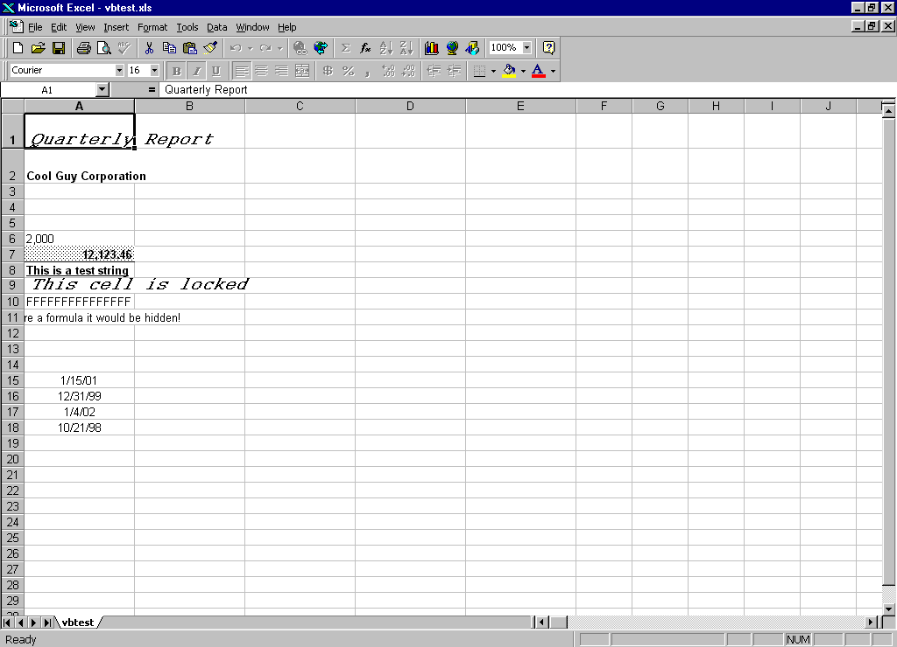



## Excel Class \- write to an XLS file without DLL's or Excel automation

### Description

Writes an Excel BIFF 2.1 spreadsheet file DIRECTLY. No external DLL's or Excel automation needed. Great for exporting data from your application to an Excel spreadsheet without the overhead of JET or ADO.

This is a small update that includes the ability to create Horizontal Page Breaks and to specify default formats for numbers and dates (for example, the number 20000 could be given a format of #,### in the file - thanks to Dieter Hauk).

Updated June 20/2001: Fixed lost row 32768 if more than 32767 rows are output to the BIFF file. Thanks to Sid Eaton for noticing this problem.

Updated November 10/2001: Added support for default row height and the ability to set the row height of individual rows. Example on how to save dates to the file.
 
### More Info
 
Refer to ZIP file.

             |
---                |---
**Submitted On**   |2001-11-10 15:23:26
**By**             |[Paul Squires](https://github.com/Planet-Source-Code/PSCIndex/blob/master/ByAuthor/paul-squires.md)
**Level**          |Intermediate
**User Rating**    |4.9 (377 globes from 77 users)
**Compatibility**  |VB 4\.0 \(32\-bit\), VB 5\.0, VB 6\.0
**Category**       |[Data Structures](https://github.com/Planet-Source-Code/PSCIndex/blob/master/ByCategory/data-structures__1-33.md)
**World**          |[Visual Basic](https://github.com/Planet-Source-Code/PSCIndex/blob/master/ByWorld/visual-basic.md)
**Archive File**   |[Excel\_Clas3441511102001\.zip](https://github.com/Planet-Source-Code/paul-squires-excel-class-write-to-an-xls-file-without-dll-s-or-excel-automation__1-11898/archive/master.zip)

